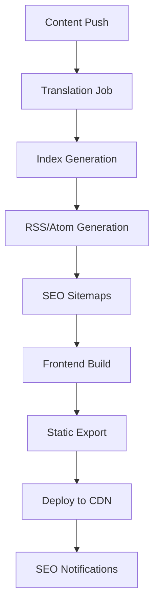

# Blog System CI/CD Runbook

Dieses Runbook beschreibt den automatisierten Build- und Deployment-Prozess für das mehrsprachige Blog-System.

## 🚀 CI/CD Pipeline Übersicht



## 📋 GitHub Actions Workflow

Erstelle `.github/workflows/blog-deploy.yml`:

```yaml
name: Blog System Deployment

on:
  push:
    branches: [ main, develop ]
    paths:
      - 'content/blog/**'
      - 'scripts/blog-*.mjs'
      - 'frontend/src/pages/Blog*.tsx'
      - '.github/workflows/blog-deploy.yml'

  pull_request:
    paths:
      - 'content/blog/**'
      - 'scripts/blog-*.mjs'

  schedule:
    # Tägliche Neuübersetzung für bessere Qualität
    - cron: '0 2 * * *'

  workflow_dispatch:
    inputs:
      force_translate:
        description: 'Alle Sprachen neu übersetzen'
        required: false
        default: 'false'
      target_environment:
        description: 'Deployment-Ziel'
        required: true
        default: 'staging'
        options:
          - staging
          - production

env:
  DEEPL_API_KEY: ${{ secrets.DEEPL_API_KEY }}
  GOOGLE_API_KEY: ${{ secrets.GOOGLE_API_KEY }}
  VITE_SITE_URL: ${{ vars.VITE_SITE_URL }}

jobs:
  translate:
    name: Blog Translation
    runs-on: ubuntu-latest
    outputs:
      translation_count: ${{ steps.translate.outputs.count }}

    steps:
      - name: Checkout
        uses: actions/checkout@v4
        with:
          fetch-depth: 0

      - name: Setup Node.js
        uses: actions/setup-node@v4
        with:
          node-version: '20'
          cache: 'npm'
          cache-dependency-path: frontend/package-lock.json

      - name: Install dependencies
        run: npm ci
        working-directory: frontend

      - name: Check for new/changed content
        id: changed-files
        run: |
          if [ "${{ github.event_name }}" = "schedule" ]; then
            echo "scheduled=true" >> $GITHUB_OUTPUT
          elif [ "${{ github.event_name }}" = "workflow_dispatch" ] && [ "${{ inputs.force_translate }}" = "true" ]; then
            echo "force=true" >> $GITHUB_OUTPUT
          else
            # Check for changes in content/blog
            CHANGED=$(git diff --name-only ${{ github.event.before }} ${{ github.sha }} -- content/blog/ | wc -l)
            if [ "$CHANGED" -gt 0 ]; then
              echo "changed=true" >> $GITHUB_OUTPUT
              echo "count=$CHANGED" >> $GITHUB_OUTPUT
            fi
          fi

      - name: Translate blog content
        id: translate
        if: steps.changed-files.outputs.changed == 'true' || steps.changed-files.outputs.scheduled == 'true' || steps.changed-files.outputs.force == 'true'
        run: |
          cd frontend
          if [ "${{ steps.changed-files.outputs.force }}" = "true" ] || [ "${{ steps.changed-files.outputs.scheduled }}" = "true" ]; then
            echo "Translating all languages..."
            npm run blog:translate
            TRANSLATED=$(find ../frontend/public/blog -name "*.json" | wc -l)
          else
            echo "Translating only changed content..."
            CHANGED_FILES=$(git diff --name-only ${{ github.event.before }} ${{ github.sha }} -- content/blog/en/*.json)
            if [ -n "$CHANGED_FILES" ]; then
              # Extract slugs from changed files
              SLUGS=$(echo "$CHANGED_FILES" | xargs basename -s .json | tr '\n' ',')
              BLOG_SLUGS=${SLUGS%,} npm run blog:translate
              TRANSLATED=$(echo "$CHANGED_FILES" | wc -l)
            else
              TRANSLATED=0
            fi
          fi
          echo "translated=$TRANSLATED" >> $GITHUB_OUTPUT

      - name: Upload translation artifacts
        if: steps.translate.outputs.translated > 0
        uses: actions/upload-artifact@v4
        with:
          name: blog-translations
          path: frontend/public/blog/
          retention-days: 30

  build-content:
    name: Build Blog Content
    needs: translate
    runs-on: ubuntu-latest
    if: needs.translate.outputs.translation_count > 0 || github.event_name == 'schedule'

    steps:
      - name: Checkout
        uses: actions/checkout@v4

      - name: Download translations
        uses: actions/download-artifact@v4
        with:
          name: blog-translations
          path: frontend/public/blog/

      - name: Setup Node.js
        uses: actions/setup-node@v4
        with:
          node-version: '20'
          cache: 'npm'
          cache-dependency-path: frontend/package-lock.json

      - name: Install dependencies
        run: npm ci
        working-directory: frontend

      - name: Generate blog indexes
        run: npm run blog:index
        working-directory: frontend

      - name: Generate RSS/Atom feeds
        run: npm run blog:rss
        working-directory: frontend

      - name: Generate SEO sitemaps
        run: npm run seo:generate
        env:
          VITE_SITE_URL: ${{ env.VITE_SITE_URL }}

      - name: Upload content artifacts
        uses: actions/upload-artifact@v4
        with:
          name: blog-content
          path: |
            frontend/public/blog/
            frontend/public/sitemap*.xml
          retention-days: 30

  build-frontend:
    name: Build Frontend
    needs: [translate, build-content]
    runs-on: ubuntu-latest
    if: needs.translate.outputs.translation_count > 0 || github.event_name == 'schedule' || github.event_name == 'workflow_dispatch'

    steps:
      - name: Checkout
        uses: actions/checkout@v4

      - name: Download content
        uses: actions/download-artifact@v4
        with:
          name: blog-content
          path: frontend/public/

      - name: Setup Node.js
        uses: actions/setup-node@v4
        with:
          node-version: '20'
          cache: 'npm'
          cache-dependency-path: frontend/package-lock.json

      - name: Install dependencies
        run: npm ci
        working-directory: frontend

      - name: Build optimized frontend
        run: npm run build:optimized
        working-directory: frontend
        env:
          VITE_SITE_URL: ${{ env.VITE_SITE_URL }}
          NODE_ENV: production

      - name: Export static routes
        run: npm run export:static
        working-directory: frontend

      - name: Validate hreflang
        run: npm run hreflang:validate
        working-directory: frontend

      - name: Upload build artifacts
        uses: actions/upload-artifact@v4
        with:
          name: frontend-build
          path: frontend/dist/
          retention-days: 7

  deploy-staging:
    name: Deploy to Staging
    needs: build-frontend
    runs-on: ubuntu-latest
    if: github.ref == 'refs/heads/develop' || (github.event_name == 'workflow_dispatch' && github.event.inputs.target_environment == 'staging')
    environment: staging

    steps:
      - name: Download build
        uses: actions/download-artifact@v4
        with:
          name: frontend-build
          path: dist/

      - name: Deploy to staging CDN
        run: |
          # Beispiel für Netlify deployment
          npm install -g netlify-cli
          netlify deploy --dir=dist --site=$NETLIFY_SITE_ID --auth=$NETLIFY_AUTH_TOKEN --prod=false
        env:
          NETLIFY_SITE_ID: ${{ secrets.NETLIFY_STAGING_SITE_ID }}
          NETLIFY_AUTH_TOKEN: ${{ secrets.NETLIFY_AUTH_TOKEN }}

      - name: Ping search engines
        run: |
          # Google Indexing Notification
          curl -X POST "https://www.google.com/ping?sitemap=https://staging.forensics.ai/sitemap.xml"

          # Bing Indexing Notification
          curl -X POST "https://www.bing.com/ping?sitemap=https://staging.forensics.ai/sitemap.xml"

  deploy-production:
    name: Deploy to Production
    needs: build-frontend
    runs-on: ubuntu-latest
    if: github.ref == 'refs/heads/main' || (github.event_name == 'workflow_dispatch' && github.event.inputs.target_environment == 'production')
    environment: production

    steps:
      - name: Download build
        uses: actions/download-artifact@v4
        with:
          name: frontend-build
          path: dist/

      - name: Deploy to production CDN
        run: |
          # Beispiel für Cloudflare Pages
          npm install -g wrangler
          wrangler pages deploy dist --project-name=forensics-blog
        env:
          CLOUDFLARE_API_TOKEN: ${{ secrets.CLOUDFLARE_API_TOKEN }}
          CLOUDFLARE_ACCOUNT_ID: ${{ secrets.CLOUDFLARE_ACCOUNT_ID }}

      - name: Ping search engines
        run: |
          # Google Indexing Notification
          curl -X POST "https://www.google.com/ping?sitemap=https://forensics.ai/sitemap.xml"

          # Bing Indexing Notification
          curl -X POST "https://www.bing.com/ping?sitemap=https://forensics.ai/sitemap.xml"

          # IndexNow für schnelle Indexierung
          curl -X POST "https://api.indexnow.org/indexnow" \
            -H "Content-Type: application/json" \
            -d '{
              "host": "forensics.ai",
              "key": "'${{ secrets.INDEXNOW_KEY }}'",
              "keyLocation": "https://forensics.ai/'${{ secrets.INDEXNOW_KEY }}'.txt",
              "urlList": ["https://forensics.ai/sitemap.xml"]
            }'

  notify:
    name: Notifications
    needs: [deploy-staging, deploy-production]
    runs-on: ubuntu-latest
    if: always()

    steps:
      - name: Slack notification
        uses: 8398a7/action-slack@v3
        if: always()
        with:
          status: ${{ job.status }}
          webhook_url: ${{ secrets.SLACK_WEBHOOK_URL }}
          fields: repo,message,commit,author,action,eventName,ref,workflow
        env:
          SLACK_WEBHOOK_URL: ${{ secrets.SLACK_WEBHOOK_URL }}

      - name: Discord notification
        if: failure()
        run: |
          curl -X POST ${{ secrets.DISCORD_WEBHOOK_URL }} \
            -H "Content-Type: application/json" \
            -d '{
              "content": "🚨 Blog deployment failed",
              "embeds": [{
                "title": "Build Failed",
                "description": "Check GitHub Actions for details",
                "url": "${{ github.server_url }}/${{ github.repository }}/actions/runs/${{ github.run_id }}"
              }]
            }'
```

## 🔧 Environment Variables

### Erforderliche Secrets

```bash
# GitHub Repository Secrets
DEEPL_API_KEY=your_deepl_api_key
GOOGLE_API_KEY=your_google_api_key
NETLIFY_AUTH_TOKEN=your_netlify_token
NETLIFY_STAGING_SITE_ID=your_staging_site_id
CLOUDFLARE_API_TOKEN=your_cf_token
CLOUDFLARE_ACCOUNT_ID=your_cf_account_id
SLACK_WEBHOOK_URL=https://hooks.slack.com/...
DISCORD_WEBHOOK_URL=https://discord.com/api/webhooks/...
INDEXNOW_KEY=your_indexnow_key
```

### Repository Variables

```bash
# GitHub Repository Variables
VITE_SITE_URL=https://forensics.ai
```

## 📊 Monitoring & Alerting

### Log Aggregation

```yaml
# Loki Configuration für Blog-System
scrape_configs:
  - job_name: 'blog-deploy'
    static_configs:
      - targets: ['localhost']
    pipeline_stages:
      - match:
          selector: '{job="blog-deploy"}'
          stages:
            - regex:
                expression: '.*Translation completed: (?<translated>\d+) articles.*'
            - labels:
                translated: translated
```

### Alert Rules

```yaml
# Prometheus Alert Rules
groups:
  - name: blog_system
    rules:
      - alert: BlogTranslationFailed
        expr: rate(blog_translation_errors_total[5m]) > 0
        for: 5m
        labels:
          severity: warning
        annotations:
          summary: "Blog translation failed"
          description: "Blog translation job failed in the last 5 minutes"

      - alert: BlogBuildFailed
        expr: rate(blog_build_errors_total[5m]) > 0
        for: 5m
        labels:
          severity: critical
        annotations:
          summary: "Blog build failed"
          description: "Blog build job failed in the last 5 minutes"
```

### Dashboard

Erstelle ein Grafana Dashboard für:
- **Translation Metrics**: Übersetzte Artikel pro Sprache
- **Build Performance**: Build-Zeiten, Fehlerquoten
- **SEO Metrics**: Sitemap-Größe, URL-Anzahl
- **Traffic Impact**: Neue URLs in Suchmaschinen

## 🧪 Quality Gates

### Pre-Deploy Checks

```bash
# Syntax validation
find content/blog -name "*.json" -exec node -e "
  const fs = require('fs');
  const content = fs.readFileSync('{}', 'utf8');
  try {
    JSON.parse(content);
    console.log('✅ {}');
  } catch (e) {
    console.error('❌ {}: ' + e.message);
    process.exit(1);
  }
" \;

# Required fields check
node scripts/validate-blog-content.mjs

# Translation quality check (sample)
node scripts/check-translation-quality.mjs
```

### Post-Deploy Validation

```bash
# Sitemap accessibility
curl -s -o /dev/null -w "%{http_code}" https://forensics.ai/sitemap.xml

# Blog routes accessibility
curl -s -o /dev/null -w "%{http_code}" https://forensics.ai/en/blog/

# RSS feed validation
curl -s https://forensics.ai/blog/rss-en.xml | xmllint --noout -

# SEO structured data validation
curl -s https://forensics.ai/en/blog/sample-article/ | grep -q "application/ld+json"
```

## 🚨 Incident Response

### Translation Failures

1. **Check API Keys**: DEEPL/Google API Status prüfen
2. **Rate Limits**: API-Limits überprüfen
3. **Content Issues**: Ungültige Zeichen oder Formatierungen
4. **Fallback**: Auf Englisch zurückfallen

### Build Failures

1. **Dependencies**: Node modules neu installieren
2. **Cache Issues**: Build-Cache leeren
3. **Content Conflicts**: JSON-Syntax validieren
4. **Memory Issues**: Node.js Memory-Limit erhöhen

### Deployment Failures

1. **CDN Issues**: CDN-Status prüfen
2. **DNS**: DNS-Propagation warten
3. **SSL**: Zertifikat-Validität prüfen
4. **Firewall**: CDN-IPs freischalten

## 📈 Performance Optimization

### Build Time Optimization

```bash
# Parallel processing
npm run blog:translate &
npm run blog:index &
npm run blog:rss &
wait

# Incremental builds
if [ -f .last-build ]; then
  CHANGED=$(find content/blog -newer .last-build)
  if [ -n "$CHANGED" ]; then
    # Only rebuild changed content
  fi
fi
touch .last-build
```

### CDN Optimization

- **Compression**: Gzip/Brotli aktivieren
- **Caching**: 1 Jahr für statische Assets
- **CDN**: Cloudflare für globale Distribution
- **Image Optimization**: WebP mit Fallback

## 🔄 Rollback Strategy

### Automated Rollback

```bash
# Rollback to previous deployment
git checkout <previous-commit>
npm run --prefix frontend build:optimized
# Deploy previous build
```

### Content Rollback

```bash
# Revert blog content changes
git checkout HEAD~1 -- content/blog/
npm run --prefix frontend blog:translate
npm run --prefix frontend build:optimized
```

## 📋 Maintenance Schedule

### Daily
- Translation quality monitoring
- Build performance tracking
- SEO metrics review

### Weekly
- Content audit (broken links, outdated info)
- Translation accuracy checks
- Search console reports review

### Monthly
- Full re-translation für Qualitätsverbesserung
- SEO strategy review
- Performance optimization

### Quarterly
- Technology stack updates
- New language additions
- Feature enhancements

---

## 📞 Support Contacts

- **Technical Issues**: dev@sigmacode.io
- **Content Issues**: editorial@sigmacode.io
- **SEO Issues**: marketing@sigmacode.io
- **Infrastructure**: infra@sigmacode.io

*Dieses Runbook wird bei Änderungen am System aktualisiert.*
